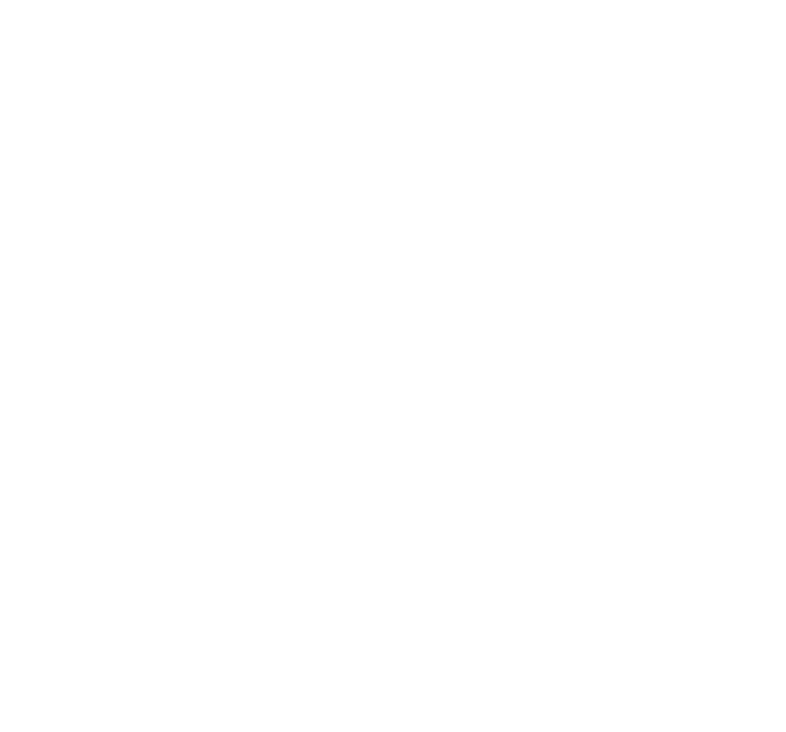

<a name="readme-top">
<br/>

<br />
<div align="center">
  <a href="https://github.com/zyx-0314/">
  <!-- TODO: If you want to add logo or banner you can add it here -->
    
  </a>
<!-- TODO: Change Title to the name of the title of your Project -->
  <h3 align="center">Title</h3>
</div>
<!-- TODO: Make a short description -->
<div align="center">
  Short Description. (Optional)
</div>

<br />

<!-- TODO: Change the zyx-0314 into your github username  -->
<!-- TODO: Change the WD-Template-Project into the same name of your folder -->


<a href="https://wakatime.com/badge/user/b16bec80-63c3-4b04-a77f-bc72e050b6dc/project/81f9802f-bffa-416a-8d1b-bf1cbeedcf63"></a>

---

<br />
<br />

<!-- TODO: If you want to add more layers for your readme -->
<details>
  <summary>Table of Contents</summary>
  <ol> H
    <li>
      <a href="#overview">Home</a>
      <ol>
        <li>
          <a href="#key-components">Key Components</a>
        </li>
        <li>
          <a href="#technology">Technology</a>
        </li>
      </ol>
    </li>
    <li>
      <a href="#rule,-practices-and-principles">Rules, Practices and Principles</a>
    </li>
    <li>
      <a href="#resources">Resources</a>
    </li>
  </ol>
</details>

---

## Overview

<!-- TODO: To be changed -->
Description of the project in details.


The project involves creating a fully functional, multi-page website modeled after Quirk Books' official site. It includes key pages: Home, Shop, About, and Contact. The layout and styling aim to replicate the aesthetic and user experience of the original website.

The Header and Footer utilized Bootstrao

The primary goal is to demonstrate familiarize front-end web development using HTML, CSS, JavaScript, and Bootstrap. This project is able to showcase: Translate an existing design into functional code, Use responsive design techniques, Implement interactivity and dynamic content.


### Key Components
- MultiPage Website
- Header & Footer
- Home Page
- Shop Page
- About Page
- Contact Page

### Technology
<!-- TODO: List of Technology Used -->


## Rules, Practices and Principles
1. Always use `WD-` in the front of the Title of the Project for the Subject followed by your custom naming.
2. Do not rename any .html files; always use `index.html` as the filename.
3. Place Files in their respective folders.
4. All file naming are in camel case.
   - Camel case is naming format where there is no white space in separation of each words, the first word is in all lower case while the succeding words first letter are in upper followed by lower cased letters.
   - ex.: buttonAnimatedStyle.css
5. Use only `External CSS`.
6. Renaming of Pages folder names are a must, and relates to what it is doing or data it holding.
7. File Structure to follow below.

```
WD-ProjectName
└─ assets
|   └─ css
|   |   └─ style.css
|   └─ img
|   |   └─ fileWith.jpeg/.jpg/.webp/.png
|   └─ js
|       └─ script.js
└─ pages
|  └─ pageName
|     └─ assets
|     |  └─ css
|     |  |  └─ style.css
|     |  └─ img
|     |  |  └─ fileWith.jpeg/.jpg/.webp/.png
|     |  └─ js
|     |     └─ script.js
|     └─ index.html
└─ index.html
└─ readme.md
```

## Resources

<!-- TODO: Add References -->
| Title | Purpose | Link |
|NavBar|Documentation and examples for Bootstrap’s powerful, responsive navigation header, the navbar.|https://getbootstrap.com/docs/5.3/components/navbar/#nav|
| Sample Title | Sample purpose would be here like this and this is the example of what it is. | trykolang.com |
